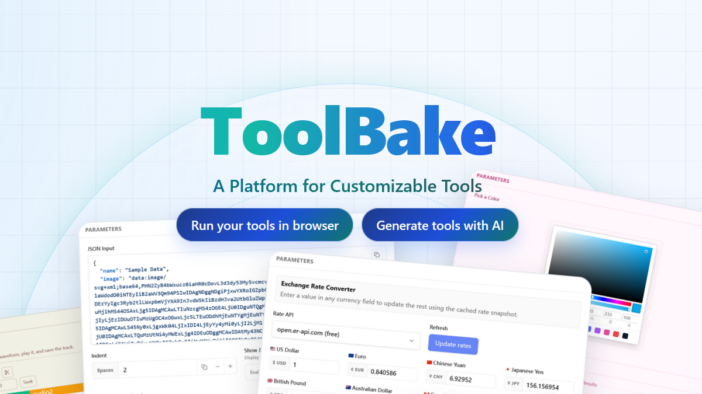

<h1 align="center">
  <br>
  ToolBake
</h1>

<p align="center"><b>A Platform for Creating Your Own Tools.</b></p>

<p align="center">
  
</p>

---

- [What is ToolBake](#what-is-toolbake)
- [How is ToolBake Different from Other Toolboxes?](#how-is-toolbake-different-from-other-toolboxes)
- [Getting Started](#getting-started)
  - [Try the Official Tools](#try-the-official-tools)
  - [Create Custom Tools](#create-custom-tools)
  - [Use AI Assistant to Create Tools](#use-ai-assistant-to-create-tools)
- [Log In to Sync Tools](#log-in-to-sync-tools)
  - [Secure Account Login System](#secure-account-login-system)
- [Roadmap](#roadmap)
  - [Short Term](#short-term)
  - [Long Term](#long-term)
- [Self-Hosted](#self-hosted)
  - [Execute the Binary](#execute-the-binary)
  - [Use Docker](#use-docker)
  - [Use Docker Compose](#use-docker-compose)
  - [Configuration](#configuration)


## What is ToolBake

ToolBake is a platform for creating your own tools. It provides a rich set of UI components and a powerful editor to help you create your own tools.

ToolBake offers incredibly powerful capabilities, ranging from common development tools to video processing, audio processing, image processing, AI Agent frontends, and even serving as a simple UI frontend.

If you want a quick first look before diving into docs, check the live demo site: [https://toolbake.com](https://toolbake.com).

## How is ToolBake Different from Other Toolboxes?

ToolBake focuses on customization, local-first execution, and practical power in the browser:

- 🎨 **Build exactly what you need**: Define your own UI and logic in the browser, then run it across desktop and mobile.
- 🤖 **AI-assisted tool creation**: Describe your requirements in chat and let the built-in AI generate `uiWidgets` and `handler` code.
- 🚀 **More than typical web tools**: Run capabilities like `ffmpeg`, `ffprobe`, and `ImageMagick`, and extend further with npm packages in your browser.
- 🔒 **Privacy by design**: Tool execution is fully local in your browser, so your processing data stays on your device.
- 📦 **Simple self-hosting**: Download the ToolBake binary and run it directly, with minimal setup.

## Getting Started

Quick path:

- [Try the Official Tools](#try-the-official-tools)
- [Create Custom Tools](#create-custom-tools)
- [Use AI Assistant to Create Tools](#use-ai-assistant-to-create-tools)

### Try the Official Tools

ToolBake comes with a rich set of built-in Official Tools:

- 🧮 Life utility tools
- 🛠️ General development tools
- 🎵 Audio processing tools
- 🎬 Video processing tools
- 🖼️ Image processing tools
- 👾 Games
<!-- - 🤖 AI Agent frontends -->
- ✨ And more

All of these tools are implemented through ToolBake's tool customization mechanism. Any feature supported by the official tools can be fully replicated in your own tools.

Visit the [ToolBake Demo website](https://toolbake.com) now to try out the various official tools and experience ToolBake's powerful capabilities.

---

### Create Custom Tools

Custom tools are the core feature of ToolBake and the biggest differentiator from other toolboxes.

Visit the [documentation](https://docs.toolbake.com/) to learn about ToolBake's execution mechanism and how to create custom tools.

---

### Use AI Assistant to Create Tools

Creating custom tools requires writing `handler` code, defining UI components, and constant debugging — too much hassle?

No problem. Visit the [documentation](https://docs.toolbake.com/docs/tutorial/use-ai-to-create-tool) to learn how to use the AI Assistant to quickly create tools that meet your needs.

---

## Log In to Sync Tools

By default, ToolBake only saves the tools you create and all related information locally in the browser.

While your information never leaves your device, this is quite inconvenient, so ToolBake also supports syncing your tool information after logging in.

Click the user avatar in the top-right corner to log in via SSO and enter login mode. When logged in, the following information will be saved to the server:

**Will be saved to the server:**

- Your custom tool `handler` code, UI definitions, and tool metadata

The following information will NOT be saved to the server:

**Will NOT be saved to the server:**

- Your OpenAI endpoint and OpenAI API Key

### Secure Account Login System

The official ToolBake website has password login disabled by default. You can only log in via SSO, with optional 2FA authentication support.

For even more secure and convenient login, ToolBake also supports Passkey login.

You can configure your login strategy in the account settings after logging in.

> Want username/password login? Refer to the Self-Hosted section below and enable username/password login.


## Roadmap

### Short Term

- [ ] Developer-facing documentation is incomplete; improve the development documentation
- [ ] Add project architecture documentation
- [ ] Support "DISABLE_USER_REGISTRATION" Env variable to disable new user registrations in self-hosted mode
- [ ] More SSO providers support
- [ ] Support Redis as NoSQL database
- [ ] Support DynamoDB as DB Backend
- [ ] Support serverless mode to let ToolBake run on AWS Lambda


### Long Term

- [ ] i18n support
- [ ] Add [webvm](https://github.com/leaningtech/webvm) support, enabling `handler` to execute Linux virtual machine commands in the browser, expanding the capabilities of `handler` (e.g., calling the `openssl` command to generate keys, etc.)


## Self-Hosted

Full self-hosted documentation can be found in the [documentation](https://docs.toolbake.com/docs/category/self-hosted).

Thanks to the characteristics of Golang, self-hosting ToolBake is extremely simple.

You just need to download the binary and run it directly — that's all it takes to self-host. No runtime environment configuration, no complex setup required.


### Execute the Binary

Visit the [Release page](https://github.com/WonderfulSoap/ToolBake/releases), download the corresponding ToolBake version, then:

Here's an example of downloading the Linux x64 version:

```bash
chmod +x toolbake-linux-amd64-v0.1.0
./toolbake-linux-amd64-v0.1.0

```

All done. After successful execution, you can access ToolBake at `http://localhost:8080`.


### Use Docker

ToolBake also provides a Docker image for users to run with Docker.

> Note: Since ToolBake runs with UID 1000 in Docker, if you want to mount a data volume with the `-v` parameter, you need to ensure the volume permissions are set to 1000:1000, otherwise permission issues may occur.

```bash
mkdir ./data
chown 1000:1000 ./data
docker run -p 8080:8080 -v ./data:/app/data -d wondersoap/toolbake 
```

After successful execution, you can access ToolBake at `http://localhost:8080`.

### Use Docker Compose

If you prefer to use Docker Compose, you can use the following configuration.

Of course, you also need to pay attention to the data volume permission issue:

```bash
mkdir ./data
chown 1000:1000 ./data
```

Then run with the following Docker Compose configuration:

```yaml
services:
  toolbake:
    image: wondersoap/toolbake
    ports:
      - "8080:8080"
    volumes:
      - ./data:/app/data
    restart: on-failure
```

### Configuration

For detailed configuration information, please refer to the [documentation](https://docs.toolbake.com/docs/selfhosted/configuration).